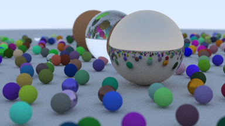

# Rust raytracer



A raytracer in Rust based on https://raytracing.github.io/books/RayTracingInOneWeekend.html.

Related project: https://github.com/advaypal/raytracer-rust

# To generate image

``` sh
cargo run > image.ppm
```
